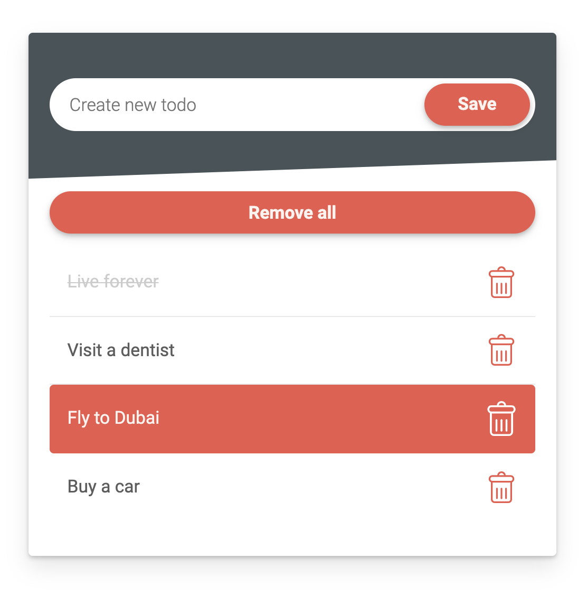

# Todo app js

Todo app with pure JS and local server.



##### *As a user I should be able to:*

- create new Task
- complete task(emit custom goal "completed")
- delete task from the list(emit custom goal "deleted")
- Design should be matched
- Add “Delete all” button to delete all tasks from the list asynchronously and sequentially. We want to see next sequence: 1) send request to the server, 2) get response that item has been removed, 3) remove element from DOM, 4) repeat from step 1 until we remove all tasks.
- You need to use all supplied function(poller, emitCustomGoal and removeInterval).

##### Bonus:

- Track how many tasks were completed. Each task should be completed only once
- Track how many tasks were removed

*All changes should persist after you refresh a page.*

##### To run your app with server:

1. Make sure you installed Node.js.
2. Check that you have installed npm.
3. Open project folder and run ```npm install```
4. Start your local server with ```json-server --watch db.json```
5. Open ```index.html```
6. Font family - 'Roboto'

This task is simple, but we expect to see very clean and structured code with attention to details.

*No front-end libraries or frameworks.*

Please leave instructions for how to run your code.
